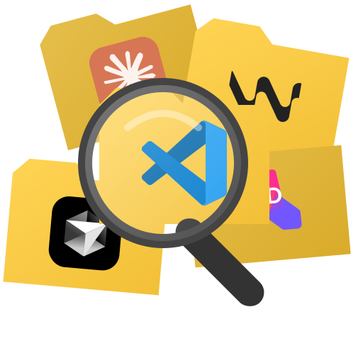
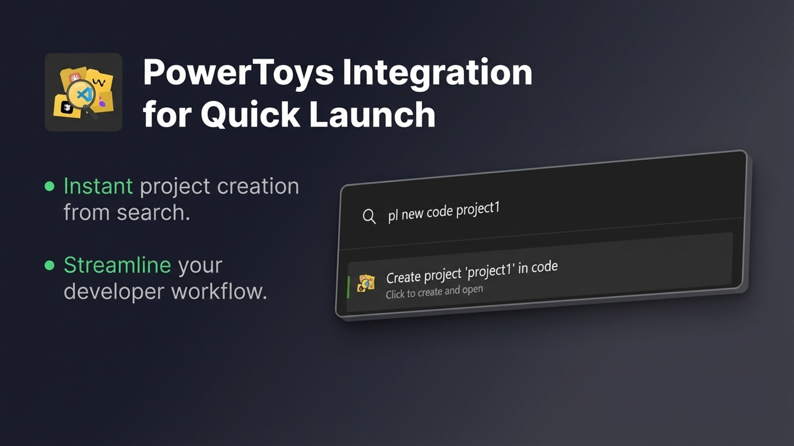

<p align="center">
  
</p>

<h1 align="center">Project Launcher — PowerToys Run Plugin</h1>

<p align="center">
  <strong>Access your code projects through PowerToys Run</strong>
</p>

<p align="center">
  
</p>

<p align="center">
  <a href="https://github.com/artickc/ProjectLauncherPowerToysPlugin/releases">
    
  </a>
  <a href="https://github.com/artickc/ProjectLauncherPowerToysPlugin/stargazers">
    
  </a>
  <a href="https://github.com/artickc/ProjectLauncherPowerToysPlugin/issues">
    
  </a>
  <a href="https://github.com/artickc/ProjectLauncherPowerToysPlugin/blob/main/LICENSE">
    
  </a>
</p>

<p align="center">
  <a href="https://apps.microsoft.com/detail/9MZ0LBGCLW6C">
    
  </a>
</p>

---

## 📖 About

[**Project Launcher**](https://apps.microsoft.com/detail/9MZ0LBGCLW6C) is a standalone Windows application for developers — a tray-first, keyboard-first launcher for searching, creating, and opening code projects across all popular IDEs.

**Project Launcher comes with its own beautiful overlay UI**, but some users prefer the unified experience of **PowerToys Run**. This plugin is for them.

### What is Project Launcher?

- 🔍 **Search** across all your projects from multiple IDEs instantly
- 🚀 **Launch** projects in your preferred IDE with one keystroke
- ✨ **Create new projects fast** — type `new project-name`, pick your IDE, and the project folder is created in your defined directory and opened automatically
- 🔗 **Open** project folders, terminals, or GitHub repositories with keyboard shortcuts
- 🎯 **Automatic discovery** — finds projects from IDE history, workspace markers, and folder scans

### Why this plugin?

Project Launcher has its own native overlay that opens via global hotkey. However, if you:
- Already use **PowerToys Run** as your primary launcher
- Want **one unified launcher** for everything
- Prefer the PowerToys Run UI

...then this plugin brings Project Launcher's powerful project management directly into PowerToys Run.

---

## ✨ Features

| Feature | Description |
|---------|-------------|
| 🔎 **Instant Search** | Fuzzy search across all indexed projects |
| 🎯 **Multi-IDE Support** | 20+ IDEs including VS Code, Cursor, Windsurf, JetBrains suite, Visual Studio, Unity |
| ✨ **Fast Project Creation** | Type `new my-project`, select IDE → folder created & opened instantly |
| ⚡ **Fast Results** | Sub-100ms search powered by local SQLite index |
| 🏷️ **Tag Filtering** | Filter by `#recent`, `#git`, or custom tags |
| 📂 **Quick Actions** | Open in IDE, Explorer, Terminal, or GitHub |

---

## 📋 Requirements

- **Windows 10/11**
- **[Microsoft PowerToys](https://github.com/microsoft/PowerToys)** installed
- **[Project Launcher](https://apps.microsoft.com/detail/9MZ0LBGCLW6C)** installed and running

> ⚠️ **Note:** Project Launcher is a paid application available on the Microsoft Store. The plugin communicates with the main app via IPC and requires it to be running in the background.

---

## 📥 Installation

### ✅ Recommended Method (Easiest)

The simplest way to install and keep the plugin updated:

1. Open **Project Launcher**
2. Go to **Settings** → **PowerToys**
3. Click **Install / Update Plugin**

That's it! The plugin will be automatically installed and PowerToys will restart.

---

### 🔧 Manual Installation

If you prefer manual installation or want to build from source:

#### Option A: Download from Releases

1. Download the latest release from [Releases](https://github.com/artickc/ProjectLauncherPowerToysPlugin/releases)
2. Extract the archive
3. Copy the contents to:
   ```
   %LOCALAPPDATA%\Microsoft\PowerToys\PowerToys Run\Plugins\ProjectLauncher
   ```
4. Restart PowerToys

#### Option B: Build from Source

```powershell
# Clone the repository
git clone https://github.com/artickc/ProjectLauncherPowerToysPlugin.git
cd ProjectLauncherPowerToysPlugin

# Build and deploy using the included script
.\deploy_and_restart.ps1
```

Or manually:

```powershell
# Build in Release mode
dotnet build -c Release

# Copy to PowerToys plugins directory
$dest = "$env:LOCALAPPDATA\Microsoft\PowerToys\PowerToys Run\Plugins\ProjectLauncher"
New-Item -ItemType Directory -Force -Path $dest
Copy-Item -Path "bin\Release\net9.0-windows10.0.19041.0\*" -Destination $dest -Recurse -Force

# Restart PowerToys
Stop-Process -Name "PowerToys" -Force -ErrorAction SilentlyContinue
Start-Process "$env:LOCALAPPDATA\PowerToys\PowerToys.exe"
```

---

## 🚀 Usage

1. Ensure **Project Launcher** is running (check for the tray icon)
2. Open **PowerToys Run** (`Alt + Space` by default)
3. Type `pl ` followed by your search query

### Examples

```
pl vscode          → Find all VS Code projects
pl my-project      → Search for "my-project"
pl #recent         → Show recently opened projects
pl cursor app      → Find projects matching "app" in Cursor
```

### Keyboard Shortcuts

| Shortcut | Action |
|----------|--------|
| `Enter` | Open project in default IDE |
| `Ctrl + Enter` | Open folder in File Explorer |
| `Alt + Enter` | Open in Terminal |
| `Ctrl + R` | Open GitHub repository |

---

## 🔧 Troubleshooting

| Problem | Solution |
|---------|----------|
| No results appearing | Make sure Project Launcher is running in the system tray |
| Plugin not loading | Verify files are in the correct PowerToys plugins folder |
| Connection errors | Restart both Project Launcher and PowerToys |

For detailed logs, check:
```
%LOCALAPPDATA%\Microsoft\PowerToys\PowerToys Run\Logs
```

---

## 🖥️ Supported IDEs

Project Launcher supports **20+ IDEs and editors**:

### Microsoft & VS Code Family
| IDE | Description |
|-----|-------------|
| **Visual Studio Code** | Microsoft's popular code editor |
| **VS Code Insiders** | Nightly builds with latest features |
| **VSCodium** | Community-driven, freely-licensed VS Code |
| **Visual Studio** | Microsoft's full-featured IDE |

### AI-Powered Editors
| IDE | Description |
|-----|-------------|
| **Cursor** | AI-first code editor (VS Code fork) |
| **Windsurf** | AI-powered code editor by Codeium |
| **Trae** | AI-powered code editor by ByteDance |
| **Qoder** | AI-assisted development environment |

### JetBrains IDEs
| IDE | Description |
|-----|-------------|
| **IntelliJ IDEA** | Java & Kotlin IDE |
| **WebStorm** | JavaScript & TypeScript IDE |
| **PyCharm** | Python IDE |
| **Rider** | Cross-platform .NET IDE |
| **GoLand** | Go IDE |
| **CLion** | C/C++ IDE |
| **RustRover** | Rust IDE |
| **PhpStorm** | PHP IDE |
| **DataGrip** | Database IDE |

### Other Editors & Tools
| IDE | Description |
|-----|-------------|
| **Unity** | Game development platform |
| **Positron** | Data science IDE by Posit |
| **Theia** | Cloud & desktop IDE framework |
| **GitPod** | Cloud development environment |
| **Obsidian** | Knowledge base / Markdown editor |
| **Claude** | Anthropic's Claude desktop app |

---

## 🔗 Links

- 📦 [Project Launcher on Microsoft Store](https://apps.microsoft.com/detail/9MZ0LBGCLW6C)
- 🐛 [Report Issues](https://github.com/artickc/ProjectLauncherPowerToysPlugin/issues)
- 💬 [Discussions](https://github.com/artickc/ProjectLauncherPowerToysPlugin/discussions)

---

## 📄 License

This project is licensed under the MIT License - see the [LICENSE](LICENSE) file for details.

---

<p align="center">
  Made with ❤️ for developers who value their time
</p>

<p align="center">
  <a href="https://apps.microsoft.com/detail/9MZ0LBGCLW6C">
    
  </a>
</p>
